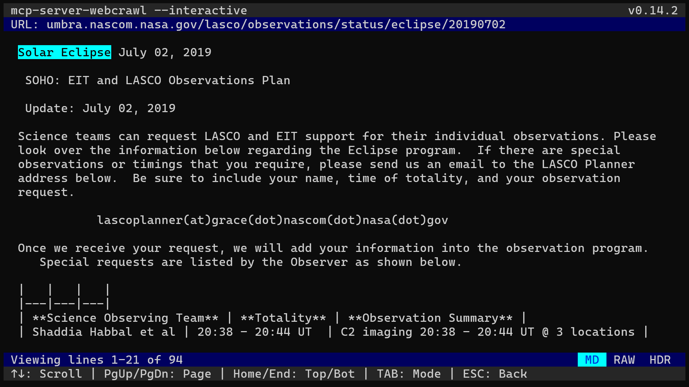

Interactive Mode
================

**No AI, just classic Boolean search of your web-archives in a terminal.**

mcp-server-webcrawl can double as a terminal search for your web archives. You can run it against your local archives, but it gets more interesting when you realize you can ssh into any remote host and view archives sitting on that host. No downloads, syncs, multifactor logins, or other common drudgery required. With interactive mode, you can be in and searching a crawl sitting on a remote server in no time at all.

Launch with --crawler and --datasource to load into search immediately, or use setup datasrc and crawler in-app.

.. code-block:: bash

   mcp-server-webcrawl --crawler wget --datasrc /path/to/datasrc --interactive
   # or manually enter crawler and datasrc in the UI
   mcp-server-webcrawl --interactive

.. figure:: _static/images/interactive.search.webp
   :alt: mcp-server-webcrawl in --interactive mode heading
   :align: center
   :width: 100%

   Interactive mode in search the main interface search interface

   Documents, along with search, include hit highlighting